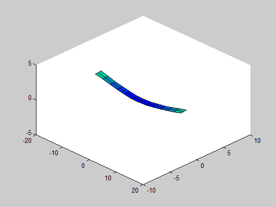

# AeroFlex
AeroFlex is a MATLAB toolbox for studying the flight dynamics of highly flexible airplanes.

Most part of development was done during [my master thesis](http://www.bdita.bibl.ita.br/tesesdigitais/lista_resumo.php?num_tese=61853),
at [ITA](http://www.ita.br). Several contributions come from the work of Marcelo S. de Sousa during [his PhD](http://www.bdita.bibl.ita.br/tesesdigitais/lista_resumo.php?num_tese=64358) at ITA.

This tool uses the mathematical development from the PhD theses of [Eric Brown (2003)](http://dspace.mit.edu/handle/1721.1/8001) 
and [Christopher Shearer (2006)](http://adsabs.harvard.edu/abs/2006PhDT.......242S).

The structural dynamics of the airplane is modeled using a strain-based geometrically non-linear beam.
For aerodynamic calculations, the strip theory is used including three modeling approaches:
a quasi-steady, quasi-steady with apparent mass and full unsteady aerodynamics representations.

Several applications can be studied using this tool:

- Simulation and stability analysis of classic wing aeroelastic phenomena like: divergence, [flutter](.\examples\example2\README.md), [control reversals](.\examples\example3\README.md);

- Simulation and [stability analysis](.\examples\example2\README.md) of nonlinear wing aeroelastic phenomena, due to nonlinear geometry deflections;

- [Simulation](.\examples\example4\README.md) and stability analysis of a flexible aircraft in free-flight condition.

## Usage and examples

My goal is to include several examples and tutorials of use of this tool, with the hope that it can be
used by other people. I am still working on it. You can check some of them [here](./examples/README.md).

All main files are in the `./main/` folder. These files are used to perform all the tasks: from
defining each component of the airplane (wings, engines, rigid units attached to the body)
to perform simulations. You can have a better idea of how AeroFlex work by reading 
[this paper](http://flavioluiz.github.io/papers/AeroFlexCONEM.pdf).

## Research using AeroFlex

Here you can find some references that used AeroFlex for studying the flight dynamics
and control of highly flexible airplanes.

* Cardoso-Ribeiro, F.L., Paglione, P., da Silva, R.G.A., de Sousa, M.S.  [AeroFlex: A toolbox for studying the flight dynamics of highly flexible airplanes](http://flavioluiz.github.io/papers/AeroFlexCONEM.pdf). CONEM 2012.

* Cardoso-Ribeiro, F.L., Paglione, P., da Silva, R.G.A. [Stability analysis of a highly flexible airplane](http://flavioluiz.github.io/papers/StabilityCONEM.pdf). CONEM 2012.

* Cardoso-Ribeiro, F.L. [Dinâmica de voo de aeronaves muito flexíveis](http://www.bdita.bibl.ita.br/tesesdigitais/lista_resumo.php?num_tese=61853), Master thesis, ITA, 2011

* de Sousa, M.S., [Modelagem, simulação e controle não linear de aviões muito flexíveis](http://www.bdita.bibl.ita.br/tesesdigitais/lista_resumo.php?num_tese=64358)

* de Sousa, M.S., Paglione, P., Cardoso-Ribeiro, F.L., da Silva, R.G.A.,  *Use of Universal Integral Regulator to Control the Flight Dynamics of Flexible Airplanes*, COBEM 2013
