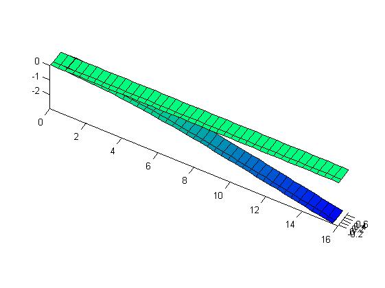
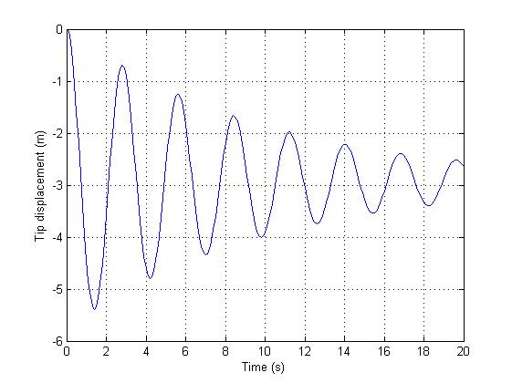

Example 1 - structural dynamics only
==========

This example uses a very flexible beam, proposed by Patil, to perform
some structural dynamics tests. No aerodynamics is taken into account.
The main goal of this example is to introduce how to write a flexible
member and how to use some analysis functions.

Three tasks are performed:
* Modal analysis (from the mass and rigidity matrices, obtained from
the undeformed structure), structural natural frequencies and 
modal shapes are obtained;
* Equilibrium calculation: the structure is subject to gravity. The
equilibrium position is calculated (this uses the nonlinear beam
formulation);
* Simulation of the autonomous response of the beam: the beam is
initially considered undeformed, the dynamic response is then
obtained (which will lead to equilibrium position).

AeroFlex initialization
----------

Defining the flexible member
----------

Modal analysis
----------

 Mode | Frequency (Hz)
  --- |   ---
  1st |  0.3565
  2nd |  2.2200
  3rd |  5.0442
  4th |  6.1471
  5th |  8.7181
  6th | 11.9868
   
 

Equilibrium computation
----------

 

Simulation
----------

 

 
